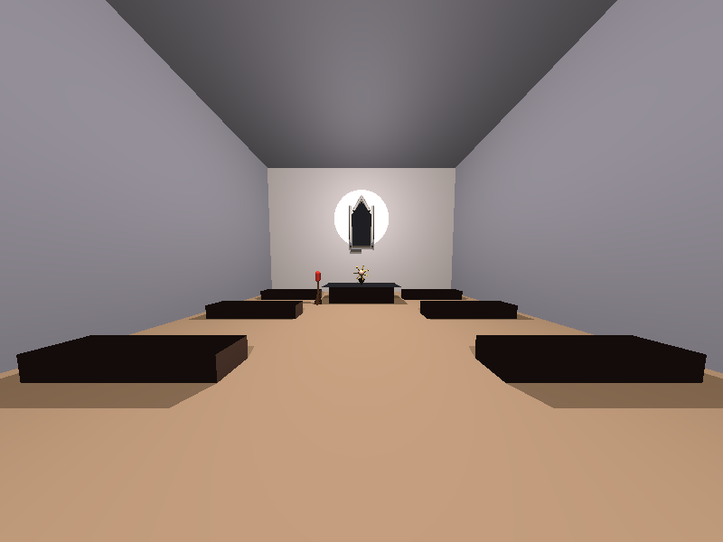

# 🎨 Computação Gráfica - Ray Casting

Trabalho final da disciplina de Computação Gráfica - Capela renderizada com ray casting.



## ✨ Características

✅ **Ray Casting completo** - Implementação from scratch  
✅ **Texturas procedurais** - Madeira (listras) + Vitral (cruz + cores)  
✅ **Primitivas geométricas** - Cone, Cilindro, Esfera, Malha  
✅ **Sombras realistas** - Shadow rays implementados  
✅ **Iluminação Phong** - Ambiente + Direcional + Pontual  
✅ **Visualizador 3D interativo** - Navegação em tempo real (100% ray casting!)  

---

## 🚀 Compilar e Executar

### Renderizar imagem final (800×600):
```bash
make capela
./capela
# Gera: output/capela.ppm
```

### Visualizador 3D interativo:
```bash
# Primeiro instale SDL2:
sudo apt-get install libsdl2-dev

# Compile e execute:
make viewer
./viewer
```

## 🎮 Controles do Visualizador

- **W/S** - Frente/Trás
- **A/D** - Esquerda/Direita  
- **Space/Shift** - Subir/Descer
- **Setas** - Olhar ao redor
- **ESC** - Sair

## 📚 Documentação

- 📖 [Documentação Completa](docs/PROJETO_FINAL.md)
- 🐛 [Bug Corrigido](docs/BUG_CORRIGIDO.md)
- 🎮 [Manual do Visualizador](docs/README_VIEWER.md)
- 🤔 [SDL2 vs OpenGL](docs/SDL2_vs_OpenGL.md)

## 🎓 Requisitos Cumpridos

### Obrigatórios (10.0):
- [x] Cone, Cilindro, Esfera, Malha
- [x] 4+ materiais diferentes
- [x] Texturas procedurais
- [x] Transformações
- [x] Iluminação (pontual + ambiente)
- [x] Câmera configurável
- [x] Projeção perspectiva
- [x] Sombras
- [x] 800×600 pixels

### Bônus (+0.5):
- [x] Luz direcional

**Nota esperada: 10.5/10.0** ⭐
